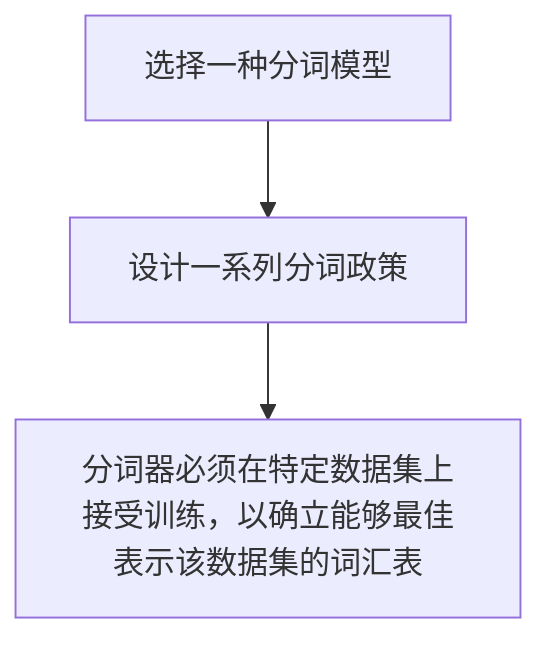

大模型分词过程
A text prompt sent to the model is first broken down into tokens.
Before the prompt is presented to the language model, however, it first has to go through a tokenizer that breaks it into pieces. 
# How Does the Tokenizer Break Down Text
分词器如何分解的文本？
三步
1. 选择一种分词模型。
2. 设计一系列分词政策。
3. 分词器必须在特定数据集上接受训练，以确立能够最佳表示该数据集的词汇表。

the tokenization method, the parameters and special tokens we use to initialize the tokenizer, and the dataset the tokenizer is trained on。
我们此前指出，决定分词器内出现哪些 token 的三大要素是：
1. 分词方法；
    
2. 初始化分词器所用的**参数与特殊标记**；
    
3. 训练分词器所用的**数据集**。
In addition to being used to process the input text into a language model, tokenizers are used on the output of the language model to turn the resulting token ID into the output word or token associated with it。
除了被用于把输入文本转化为语言的进程中，分词器同样用于语言大模型的输出过程中：将生成的 token ID 解码回对应的单词或子词，从而得到人类可读的文本。
# Word vs. Subword vs. Character vs. Byte Token
**词级 vs. 子词级 vs. 字符级 vs. 字节级 Token**

| 层级                       | 描述                                                                                           | 优点                                                                          | 缺点                                               |
| ------------------------ | -------------------------------------------------------------------------------------------- | --------------------------------------------------------------------------- | ------------------------------------------------ |
| Word tokens（词级token）     | 早期分词层级，在当前模型基本不适用，现在多用于推荐系统中。                                                                |                                                                             | 1. 分词器无法处理在训练之后又添加的新词汇。 2. 导致词表中存在大量仅有细微区别的token |
| Subword tokens（子词级token） |                                                                                              | 1. 词汇表的表达能力。2. 通过把新词汇拆分为词表中已有的更小的字符来表述新单词。3. 能在 Transformer 有限的上下文长度内塞进更多文本 |                                                  |
| Character tokens         | While that makes the representation easier to tokenize, it makes the modeling more difficult | 1.让分词更简单                                                                    | 1.让建模更复杂                                         |
| Byte tokens              | 把 token 进一步拆成表示 Unicode 字符的**单个字节**                                                          | 在多语言场景下尤其具有竞争力                                                              |                                                  |
One distinction to highlight here: some subword tokenizers also include bytes as tokens in their vocabulary as the final building block to fall back to when they encounter characters they can’t otherwise represent. The GPT-2 and RoBERTa tokenizers do this, for example. This doesn’t make them tokenization-free byte-level tokenizers, because they don’t use these bytes to represent everything, only a subset。
这里需要强调一点：某些子词分词器也会把**字节**纳入词表，作为遇到无法表示字符时的“最后退路”。例如 GPT-2 和 RoBERTa 的分词器就如此。但这并不等同于“无分词的字节级分词器”，因为它们并非用字节表示所有内容，而只在子集范围内使用。
# Comparing Trained LLM Tokenizers
对比已经训练的大模型分词器

![[Pasted image 20251228164317.png]]![[Pasted image 20251228164326.png]]![[Pasted image 20251228164341.png]]![[Pasted image 20251228164356.png]]
# okenizer Properties
分词器特性 / 分词器属性