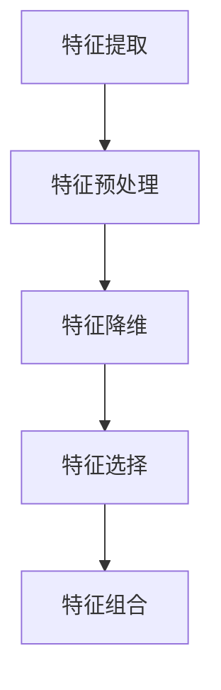

***数据和特征决定了机器学习的上限，而模型和算法只是逼近这个上限而已***
**定义**：将原始数据（Raw Data）转化为更能代表预测模型输入的特征（Features）的过程**过程**：

## 特征提取
原始数据中提取与任务相关的特征，构成特征向量。
## 特征预处理

## 特征降维
将原始数据的维度降低，叫做特征降维。
**一般会对原始数据产生影响**
## 特征选择
原始数据特征很多，与任务相关是其中一个特征集合子集。
**不会改变原数据**
## 特征组合
把多个的特征合并成一个特征。
