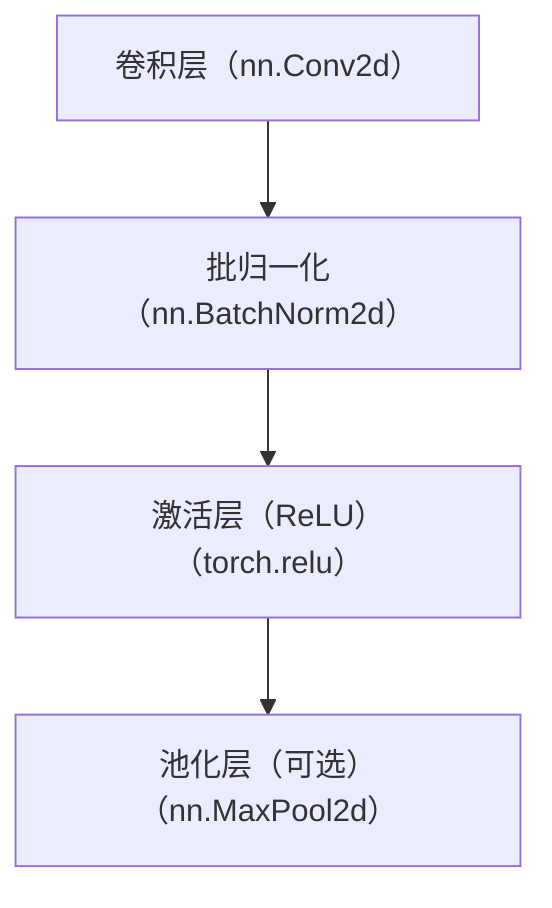
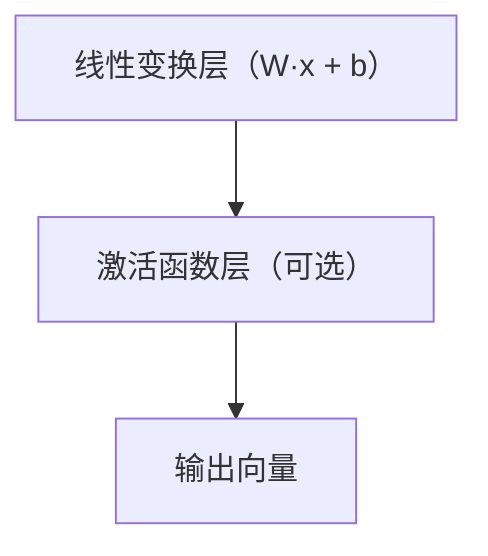

**卷积神经网络整体结构：**
- **输入层 Input**
    图片 → 格式：`N, C, H, W`
- **卷积块（重复 N 次）**
    这是 CNN 的主体，一般会堆叠 3~5 组甚至更多：
    - **卷积层 Conv2d**
    - **批归一化 BN（可选但常用）**
    - **激活层 ReLU**
    - **池化层 MaxPool2d（可选）**
- **展平层 Flatten**
    把多维特征拉成一维向量
- **全连接层 FC / Linear**
    做分类 / 回归
    （全连接层也会使用激活函数）
- **输出层 Softmax / Sigmoid**
    得到概率
# 卷积块的组成结构

# 扩展：n.Sequential的使用
是 PyTorch 提供的**有序容器**，可以将多个神经网络层按顺序封装成一个 “组合层”，数据会按定义的顺序依次流经每一层 —— 简单说就是 “把零散的层打包成一个整体”。
```python 
import torch 
import torch.nn as nn 
# 封装一个卷积块：Conv → BN → ReLU → MaxPool 
conv_block = nn.Sequential( 
	nn.Conv2d(3, 10, kernel_size=5), 
	nn.BatchNorm2d(10), 
	nn.ReLU(), 
	nn.MaxPool2d(2, 2) 
)
```
# 全连接层结构
